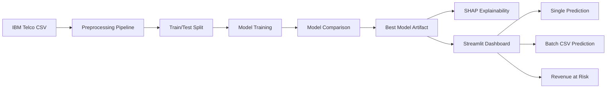
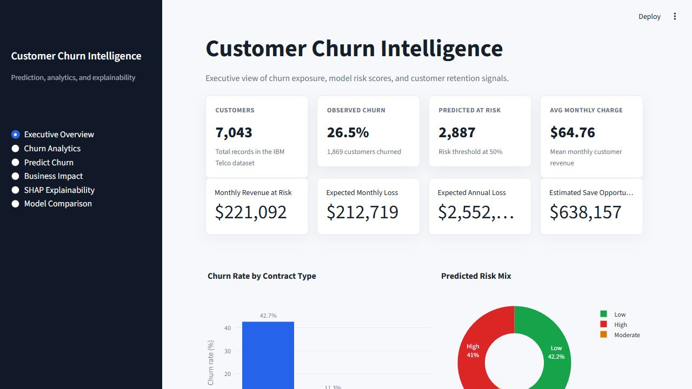
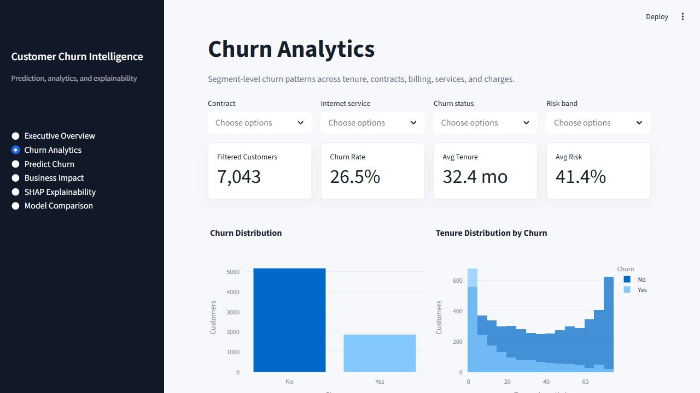
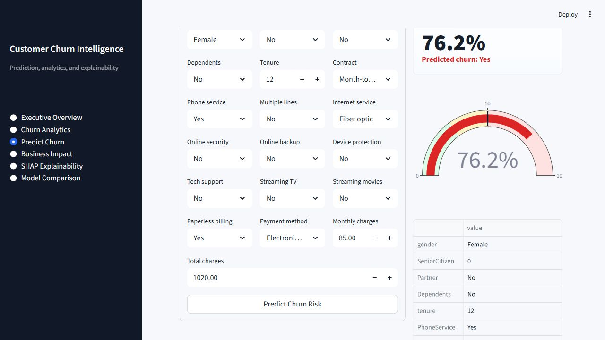
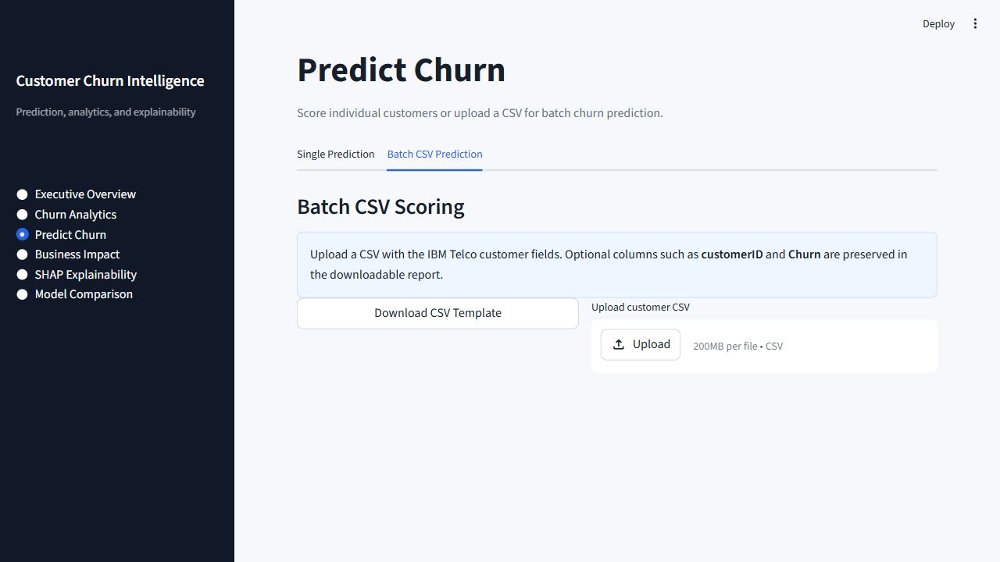
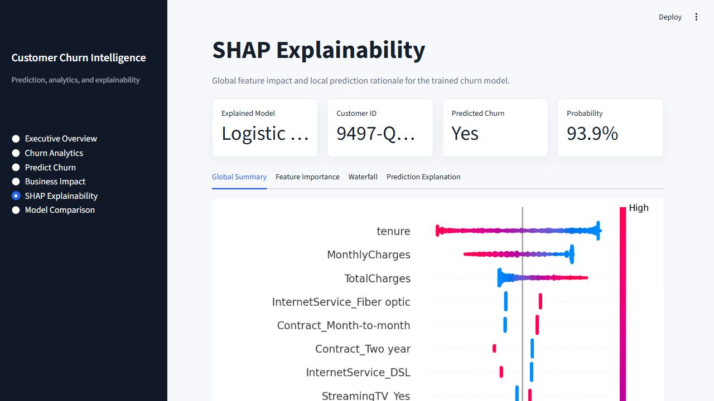
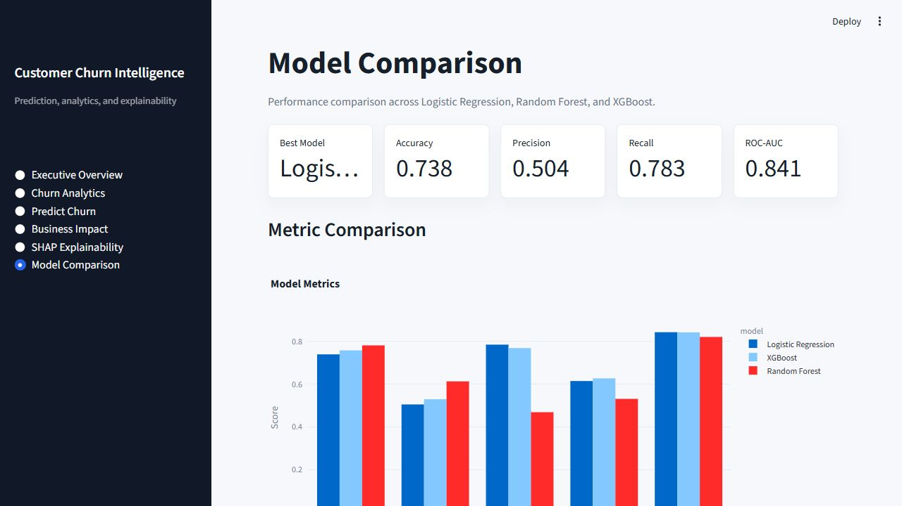

# Customer Churn Intelligence System

A production-style machine learning project for analyzing, predicting, and explaining customer churn using the IBM Telco Customer Churn dataset.

The system combines exploratory data analysis, a reusable preprocessing pipeline, supervised model training, SHAP explainability, and a professional Streamlit dashboard with single and batch prediction workflows.

## Overview

Customer churn is one of the most important retention problems for subscription and telecom businesses. This project helps business and data teams identify customers likely to churn, understand the drivers behind churn risk, and prioritize retention actions based on revenue exposure.

The project supports:

- Exploratory data analysis with pandas and Plotly
- Modular preprocessing with scikit-learn pipelines
- Model training and comparison across Logistic Regression, Random Forest, and XGBoost
- SHAP explainability for global and local model interpretation
- Streamlit dashboard for churn analytics, prediction, and business impact analysis
- CSV batch scoring with downloadable prediction reports
- Revenue-at-risk and retention recommendation workflows

## Architecture

```text
customer-churn-intelligence-system/
|
|-- data/                     Raw and archived IBM Telco churn data
|-- notebooks/                EDA and experimentation notebooks
|-- src/
|   |-- preprocessing/        Cleaning, encoding, scaling, train-test split
|   |-- training/             Model training, comparison, persistence
|   |-- inference/            Model loading and prediction utilities
|   |-- visualization/        Reusable chart helpers
|   |-- utils/                SHAP explainability and shared utilities
|   `-- api/                  API serving entry point
|-- dashboard/                Streamlit dashboard application
|-- models/                   Saved preprocessing pipeline, encoder, best model
|-- outputs/                  Metrics, confusion matrices, SHAP reports
|-- .streamlit/               Streamlit theme configuration
|-- requirements.txt          Python dependencies
|-- main.py                   Project command runner
`-- README.md
```

### Pipeline Flow



## Features

### Exploratory Data Analysis

- Dataset overview
- Missing value analysis
- Duplicate checking
- Churn distribution
- Contract, tenure, and monthly charge analysis
- Correlation analysis
- Interactive Plotly visualizations
- Written observations and business takeaways

Notebook:

```text
notebooks/eda.ipynb
```

### Preprocessing Pipeline

Implemented with scikit-learn pipelines:

- Duplicate removal
- Missing value handling
- Target label encoding
- One-hot encoding for categorical features
- Scaling for numerical features
- Stratified train-test split
- Saved preprocessing pipeline and target encoder

Run:

```bash
python src/preprocessing/preprocess.py
```

Artifacts:

```text
models/preprocessing_pipeline.joblib
models/target_encoder.joblib
```

### Model Training

The training pipeline compares:

- Logistic Regression
- Random Forest
- XGBoost

Metrics generated:

- Accuracy
- Precision
- Recall
- F1-score
- ROC-AUC
- Confusion matrix

Run:

```bash
python main.py train
```

Outputs:

```text
models/best_churn_model.joblib
outputs/model_comparison.csv
outputs/confusion_matrices.json
```

Current model comparison:

| Model | Accuracy | Precision | Recall | F1-score | ROC-AUC |
| --- | ---: | ---: | ---: | ---: | ---: |
| Logistic Regression | 0.7381 | 0.5043 | 0.7834 | 0.6136 | 0.8415 |
| XGBoost | 0.7566 | 0.5285 | 0.7674 | 0.6260 | 0.8406 |
| Random Forest | 0.7800 | 0.6119 | 0.4679 | 0.5303 | 0.8194 |

### SHAP Explainability

Generates:

- SHAP summary plot
- SHAP feature importance plot
- SHAP waterfall plot
- Prediction explanation JSON
- Prediction explanation CSV
- Human-readable prediction explanation Markdown

Run:

```bash
python main.py explain
```

Outputs:

```text
outputs/shap/shap_summary.png
outputs/shap/shap_feature_importance.png
outputs/shap/shap_waterfall.png
outputs/shap/prediction_explanation.md
outputs/shap/prediction_explanation.json
outputs/shap/prediction_explanation_features.csv
```

### Streamlit Dashboard

The dashboard includes:

- Sidebar navigation
- Executive KPI cards
- Churn analytics charts
- Single-customer prediction form
- CSV batch upload prediction
- Downloadable prediction reports
- Revenue-at-risk analysis
- Business recommendations
- SHAP explainability page
- Model comparison page
- Modern light analytics UI

Run:

```bash
python main.py dashboard
```

Then open:

```text
http://127.0.0.1:8501
```

## Screenshots

Dashboard screenshots are stored in `docs/screenshots/`.

### Executive Overview



### Churn Analytics



### Prediction Form



### Batch Prediction



### SHAP Explainability



### Model Comparison



## Setup

### 1. Clone the Repository

```bash
git clone https://github.com/your-username/customer-churn-intelligence-system.git
cd customer-churn-intelligence-system
```

### 2. Create a Virtual Environment

Windows:

```bash
python -m venv venv
venv\Scripts\activate
```

macOS/Linux:

```bash
python -m venv venv
source venv/bin/activate
```

### 3. Install Dependencies

```bash
pip install -r requirements.txt
```

### 4. Add the Dataset

Place the IBM Telco Customer Churn CSV here:

```text
data/WA_Fn-UseC_-Telco-Customer-Churn.csv
```

Expected target column:

```text
Churn
```

### 5. Run the Full Workflow

Preprocess data:

```bash
python main.py --help
python src/preprocessing/preprocess.py
```

Train models:

```bash
python main.py train
```

Generate SHAP explainability artifacts:

```bash
python main.py explain
```

Launch dashboard:

```bash
python main.py dashboard
```

## Usage

### Single Prediction

Open the dashboard, go to `Predict Churn`, enter customer attributes, and submit the form. The dashboard returns:

- Predicted churn label
- Churn probability
- Risk gauge
- Downloadable single prediction report

### Batch Prediction

Open `Predict Churn`, select the `Batch CSV Prediction` tab, upload a customer CSV, and download the scored report.

The report includes:

- Churn probability
- Predicted churn label
- Risk band
- Monthly revenue at risk
- Expected monthly loss
- Expected annual loss
- Recommended retention action

### Business Impact

Open `Business Impact` to review:

- High-risk customer count
- Monthly revenue at risk
- Expected annual loss
- Estimated save opportunity
- Segment-level revenue exposure
- Highest-priority customers
- Recommended retention campaigns

## Deployment

### Local Deployment

```bash
python main.py dashboard
```

### Streamlit Community Cloud

1. Push this repository to GitHub.
2. Ensure `requirements.txt` is committed.
3. Ensure the dataset and required model artifacts are available to the app.
4. In Streamlit Community Cloud, select this repository.
5. Set the app entry point:

```text
dashboard/app.py
```

6. Deploy the app.

For production deployment, consider storing large datasets and model artifacts in cloud storage instead of Git.

### Server Deployment

On a VM or internal analytics server:

```bash
pip install -r requirements.txt
python main.py train
python main.py explain
streamlit run dashboard/app.py --server.address 0.0.0.0 --server.port 8501
```

Then expose the service through a reverse proxy such as Nginx or a platform load balancer.

## Future Improvements

- Add automated tests for preprocessing, training, and dashboard scoring
- Add experiment tracking with MLflow
- Add model monitoring for data drift and performance decay
- Add threshold tuning based on retention campaign cost
- Add customer lifetime value modeling
- Add user authentication for dashboard access
- Add API endpoints for real-time prediction serving
- Add Dockerfile and CI/CD deployment workflow
- Add scheduled batch scoring for recurring customer portfolios
- Add database integration for production customer data

## Tech Stack

- Python
- pandas
- scikit-learn
- XGBoost
- SHAP
- Plotly
- Streamlit
- joblib

## License

This project is licensed under the terms of the included `LICENSE` file.
